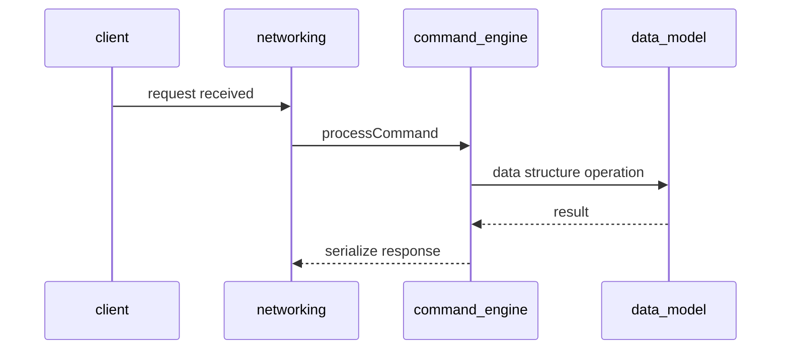
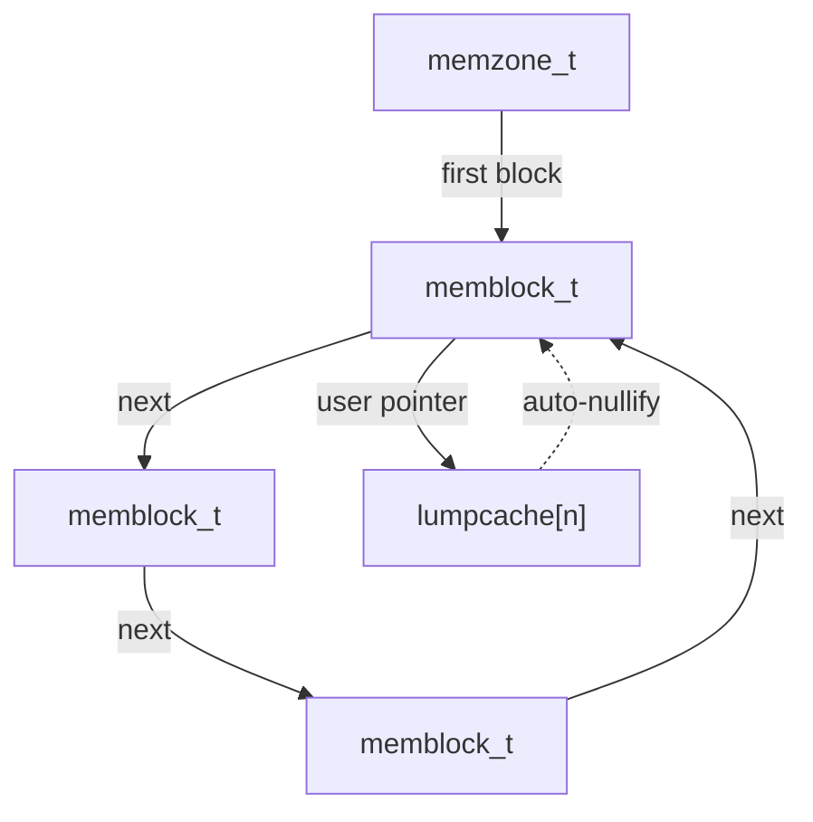
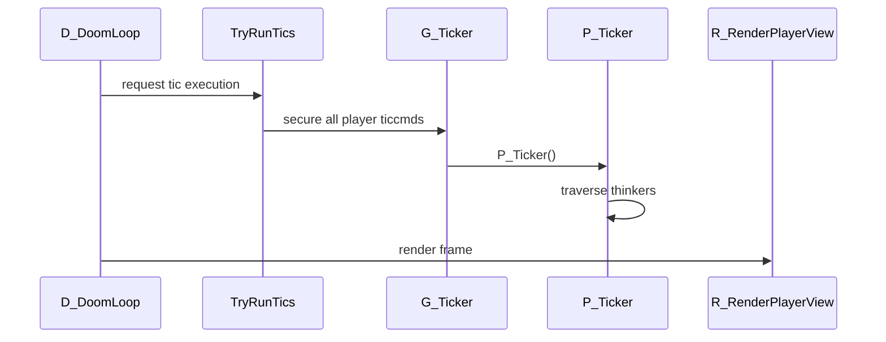
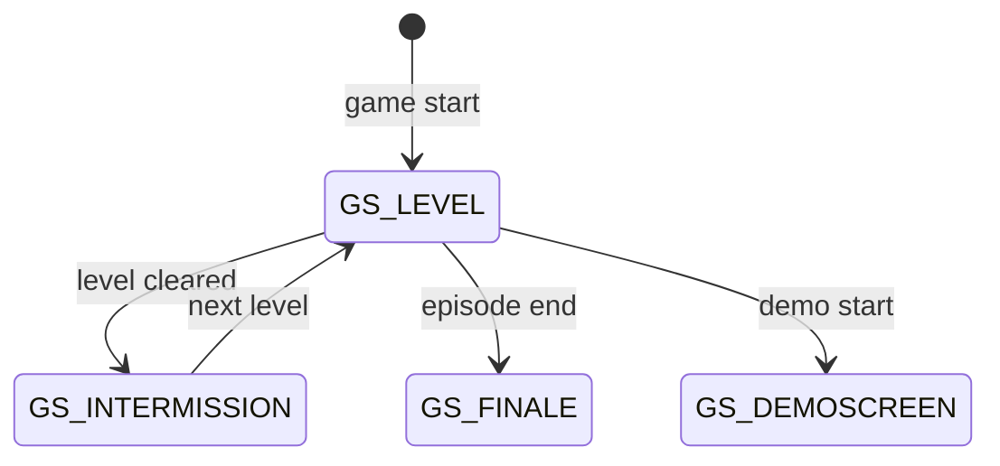
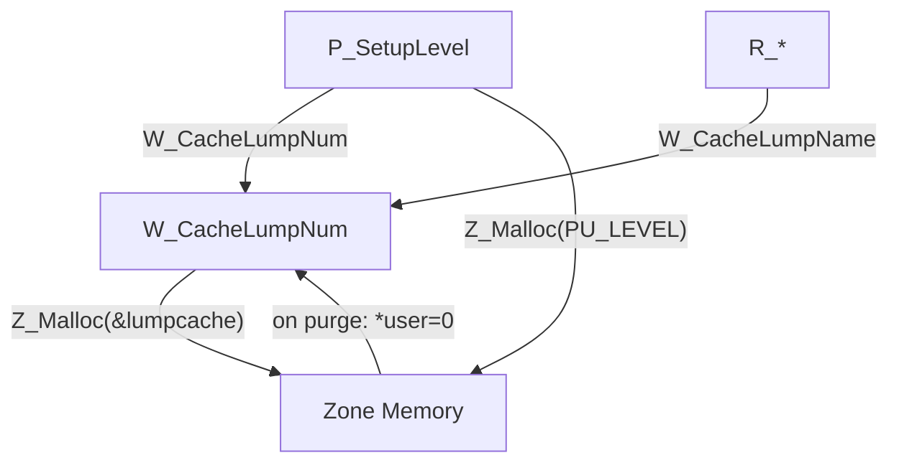
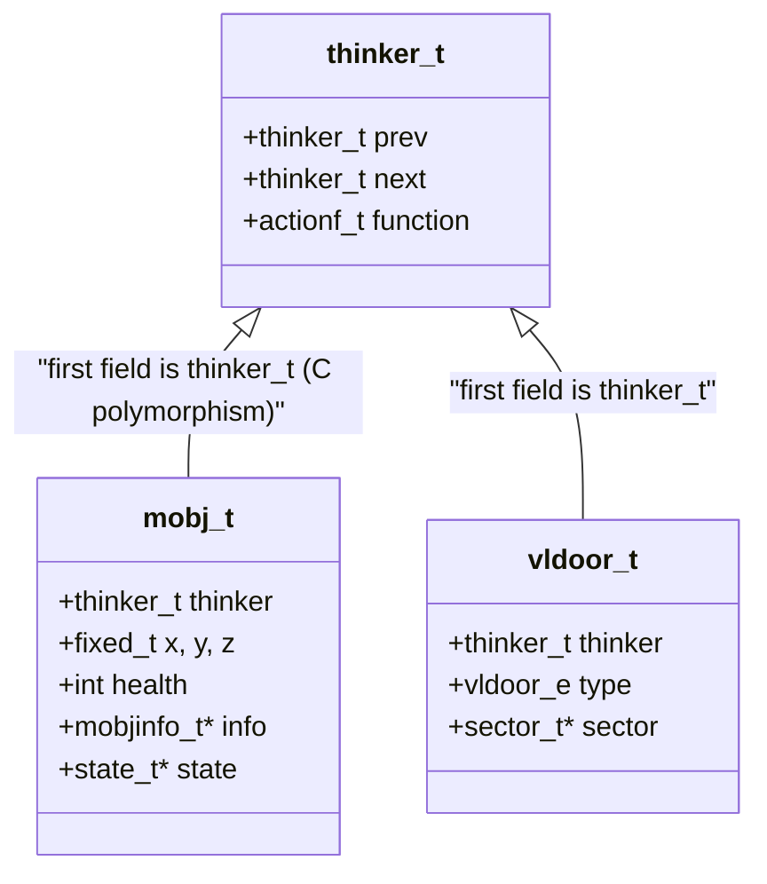

# Chapter Template

> **Output language**: Write in the language specified in the sub-agent prompt's meta block. Code snippets, file paths, and technical terms remain as-is.

A structural guide for Phase 5 Per-Chapter Writing. Not a rigid format, but a guide for narrative flow.

---

## Chapter Structure

### 1. Opening: Why Was This Needed (+ Anecdote)

Lead the reader to the moment they feel "ah, so that's why this was needed." Start with **a developer anecdote or the situation at the time** whenever possible. Do not begin with abstract technical descriptions.

Good example:
> In 1993, a PC had 4MB of RAM. Less than what a single Chrome tab consumes today. Into this space, DOOM had to load hundreds of textures, dozens of monsters, and complex 3D maps — all at once.
>
> Standard `malloc`? Not an option. Memory fragmenting like Swiss cheese was only a matter of time, and in 4MB, fragmentation meant a crash. Carmack needed his own memory manager.

Bad example:
> Zone Memory Allocator is DOOM's memory management subsystem, supporting fragmentation prevention and lifetime-based deallocation.

### 2. Core Data Structures: How Code Represents the World

Explain "why this is remarkable" first, then show the code. Code snippets **must include comments in {output_language}** explaining key lines.

Place **inline callout boxes** (`> **📌 ...**: ...`) before and after code blocks to provide background knowledge, analogies with modern technology, and terminology explanations. Ensure the reader does not have to decode the code alone.

Good example:

> The heart of Zone Memory is a doubly-linked list node called `memblock_t`. Similar to a modern C `malloc` header, but with one crucial difference — the **purge tag**.

```c
typedef struct memblock_s {
    int size;           // Size of this block (including header)
    void **user;        // Pointer to whoever uses this memory. NULL means free block
    int tag;            // PU_STATIC, PU_LEVEL, PU_CACHE, etc. — lifetime tag
    int id;             // ZONEID (0x1d4a11). Magic number for boundary violation detection
    struct memblock_s *next;  // Next block
    struct memblock_s *prev;  // Previous block
} memblock_t;
```

> **📌 The `user` pointer**: This is Zone Memory's secret weapon. When a texture pointer from the WAD cache is linked here, purging this block when memory runs low automatically NULLs the texture pointer too. No separate "cache invalidation code" needed.
>
> **📌 The magic number `0x1d4a11` in `id`**: "1d4all" — a pun on "id for all." In-house humor at id Software.

Use Mermaid diagrams to visualize relationships between data structures.

### 3. Core Algorithms: How It Works

Trace the execution flow. Actively use sequence diagrams or flowcharts. When showing code:
- **Awe first**: "This function is 17 lines, and those 17 lines determine the draw order of every wall on screen."
- **Code + comments**: Comments in {output_language} on key lines
- **Callout boxes**: Below the code, use `> **📌 ...**: ...` format to explain "why this is amazing" and "what the modern equivalent is"



### 4. Boundaries: What It Knows and What It Doesn't

Explicitly state what this module intentionally does not know. Boundaries reveal the quality of abstraction. Use analogies actively:

> "The Event Loop is a mail carrier. It knows when letters arrive, but not what's inside them. And that's the whole point."

### 5. Trade-offs: The Climax (+ Episodes)

What this design gave up and what it gained. The entire chapter has been building toward this. Deliver trade-offs **as stories**:

> "Carmack gave up multicore. Even if 7 out of 8 cores sat idle, he didn't care. What he got in return? A world without a single lock. A world where race conditions don't exist. A world where dozens of monsters move smoothly on a 25MHz CPU in 1993."

When possible, close with developer anecdotes or traces left in the code (comments, variable names, etc.).

---

## Diagram Guide

**Diagrams are mandatory, not optional.** At least 2 per chapter, 4-6 for content-rich chapters. Two diagrams in a 60,000-word book is not enough. If a single diagram can replace 3 paragraphs of text, the diagram comes first.

### Required Diagram Types

Every chapter must include **at least 2** of the following:

**1. Data Structure Relationships** (`graph TD` or `graph LR`)
Visualize relationships between the module's core structs/types. Showing field-level detail is even better.



**2. Execution Flow** (`sequenceDiagram` or `flowchart TD`)
Show the call order of key functions and inter-module interactions.



**3. State Transitions** (`stateDiagram-v2`)
Required for modules with state machines.



**4. Hierarchy/Dependency Diagrams** (`graph TD`)
Show the hierarchical structure or dependency direction between modules.



**5. Class/Module Diagrams** (`classDiagram`)
Even for non-OO languages, express logical module structure and interface relationships. C's "struct + function pointer" pattern becomes clearer when expressed as a class diagram.



**6. Memory Layout** (`graph LR`)
For showing the physical arrangement of memory structures.

### Mermaid Usage Principles

- Place diagrams **before the text explanation**. The reader sees the picture first, then deepens understanding through text.
- **Node labels use code name + one-line description** format: `A["memblock_t — memory block header"]`
- **Do not use colors/styles** — Mermaid's default styling has the best compatibility.
- **Split complex diagrams** — If a diagram exceeds 15 nodes, it is better to split it into two.

---

## Inline Callout Boxes

Actively use callout boxes after code blocks or technical concepts. Two types:

### 📌 General Callout Box

`> **📌 ...**: ...` format. Adds depth without breaking the flow of the main text:
- **Terminology explanation**: Technical terms the reader may not know
- **Modern technology contrast**: "The same principle as React's Virtual DOM"
- **Analogies**: "Think of it as a private bank"
- **Historical context**: "This predates Erlang by 20 years"
- **Developer culture**: Interesting variable names, comments, anecdotes

### 📐 Software Engineering Callout Box

`> **📐 Design Pattern — {pattern name}**: ...` format. Teach the reader about design patterns, architecture patterns, and software engineering principles found in the code:

```markdown
> **📐 Design Pattern — Command Pattern**: `ticcmd_t` is a textbook Command pattern. It encapsulates player intentions like "move forward" and "fire" into an 8-byte struct that can be sent over the network, executed later, and recorded as a demo. The GoF book's definition — "encapsulate a request as an object, enabling queuing, logging, and undo" — is alive in 1993 C code.
```

```markdown
> **📐 Principle — Separation of Concerns**: DOOM's filename prefixes (p_, r_, i_, s_) are effectively namespaces. Simulation (p_*) doesn't know how things are drawn on screen, and rendering (r_*) doesn't know how monsters move. Thanks to this separation, the rendering system can be replaced entirely without affecting game logic.
```

Principles for 📐 boxes:
- Use **standard names** for patterns (Strategy, Command, Observer, SOLID, etc.)
- Explain **"why this code is that pattern"** clearly in 1-2 sentences
- It is even better to **contrast with familiar examples from other languages/frameworks** ("Same principle as Java's Runnable")
- **How this pattern was implemented in the language** — What language features were leveraged or worked around to realize the pattern
- Do not force-fit — only when the code genuinely matches the pattern

2-5 📐 boxes per chapter is the sweet spot. Too many and it becomes a textbook; too few and you miss opportunities.

## Length

Minimum 3,000 words per chapter. In-depth chapters of 5,000-8,000 words are fine. Since the reader is someone studying code, code comments and callout boxes will account for a significant portion. Avoid unnecessary repetition, but rich explanation that aids understanding is welcome. Short paragraphs, many subheadings — easy to read while scrolling.
