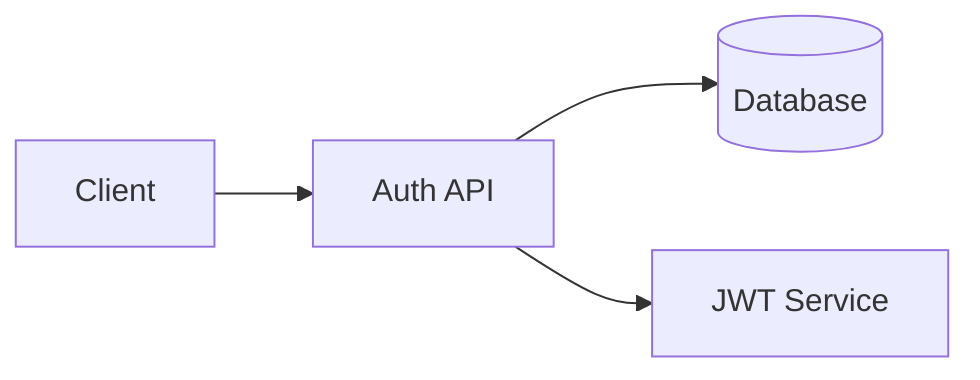
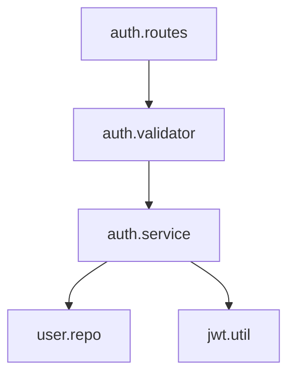
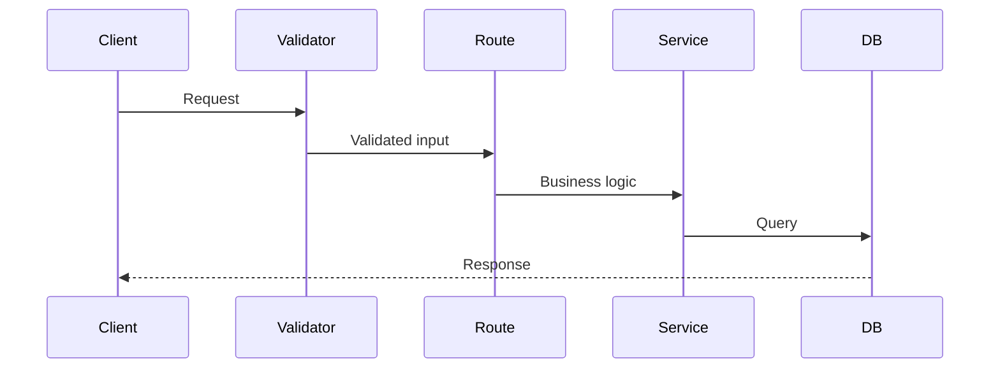

# Sprint Briefing Skill

Explain work done on a specific Feature, Task, or topic in a detailed but approachable way, using diagrams and storytelling.

## Overview

This skill generates a structured briefing that tells the **story** of work — what happened, why decisions were made, what changed, and what lies ahead. Designed for review, understanding, and future planning.

**Two modes:**
- **Sprint-bound** — Target is a Feature/Task ID within a sprint
- **General** — No sprint; explain based on git history and code analysis

---

## When to Use

- When you need to understand what happened on a Feature or Task
- When reviewing progress before planning next steps
- When you want a clear explanation of code structure and changes
- When preparing a saved document summarizing a body of work

---

## Prerequisites

### Sprint-bound Mode

This skill operates in a sprint folder containing:
- `BACKLOG.md` — Feature/Task structure and status
- `HANDOFF.md` — Current progress status
- `active/` — Feature working contexts
- `refs/` — Designs, plans, decisions, lessons

### General Mode

No sprint required. Operates on:
- Git repository with commit history
- Source code files in the working directory

---

## Workflow

### Step 1: Detect Mode & Identify Target

#### 1.1 Detect Mode

```
User specifies sprint?
├── YES → Sprint-bound mode (use specified sprint)
└── NO
    └── Check current directory for sprint files (BACKLOG.md, HANDOFF.md)
        ├── Found → Sprint-bound mode
        └── Not found → General mode
```

#### 1.2 Identify Target

**If user specifies a target** (e.g., "briefing F1", "explain T2.3", "explain auth module"):

| Input | Mode | Action |
|-------|------|--------|
| `F{n}` | Sprint-bound | Feature-level briefing |
| `T{n}.{m}` | Sprint-bound | Task-level briefing |
| `F{n}, F{m}` | Sprint-bound | Feature group briefing |
| Module/path/topic | General | Code/git-based briefing |

**If user does NOT specify a target:**

Do NOT assume. Show recommendations and ask user to pick.

Sprint-bound recommendations:
```
Available briefing targets:

Recently Active
1. F1: User Authentication (T1.3 in_progress, 2/4 tasks done)
2. T2.1: Profile API (done 2024-01-28)

All Features
3. F1: User Authentication (2 done, 1 in_progress, 1 backlog)
4. F2: User Profile (0/3 tasks, backlog)

Which would you like a briefing on?
```

General mode recommendations:
```
No sprint detected. Analyzing git history...

Recent activity:
1. src/auth/ — 15 commits in last 2 weeks
2. src/api/routes/ — 8 commits in last 2 weeks
3. docs/ — 5 commits in last week

Which area would you like a briefing on?
```

---

### Step 2: Gather & Analyze Information

> **CRITICAL: This is the accuracy step. Thoroughness here prevents hallucination.**
>
> **Rules:**
> 1. Read ALL relevant sources BEFORE generating any explanation
> 2. Only state facts confirmed by sources
> 3. Mark inferences explicitly: "[inferred from commit message]"
> 4. Missing information → state honestly: "No design doc found for F2"
> 5. Never present guesses as facts

#### 2.1 Sprint-bound: Information Sources

Read in order. Track what each source contributes.

**Phase A — Sprint context (always read):**

| Source | File | Information |
|--------|------|-------------|
| Backlog | `BACKLOG.md` | Feature/Task list, status, ordering, dependencies |
| Work Board | `HANDOFF.md` | Current progress, recent completions, blockers |

**Phase B — Target-specific:**

| Source | File Pattern | Information |
|--------|-------------|-------------|
| Feature Design | `refs/designs/F{n}-*.md` | Goals, architecture, API design |
| Task Plans | `refs/plans/F{n}-T{m}-*.md` | Implementation approach, sub-tasks |
| Active Context | `active/F{n}-*.md` | Status, notes, modified files, open questions |
| Decisions | `refs/decisions/F{n}-*.md` | Decisions made, rationale |
| Sprint Decisions | `refs/decisions/_sprint.md` | Sprint-wide decisions |
| Lessons | `refs/lessons/F{n}-*.md` | Lessons learned |
| Sprint Lessons | `refs/lessons/_sprint.md` | Sprint-wide lessons |

**Phase C — Code-level (when target involves coding):**

| Source | Method | Information |
|--------|--------|-------------|
| Git log | `git log --oneline -- <modified-files>` | Commit history |
| Git diff summary | `git diff --stat <range>` | Files changed, scope |
| Source files | Read files from active context | Actual implementation |
| Test files | Read corresponding test files | Coverage, behavior |

**Phase D — Related Features:**

From BACKLOG.md ordering:
- **Previous Feature**: Feature listed immediately before the target
- **Next Feature**: Feature listed immediately after the target
- Include their status and connection to the target

#### 2.2 General Mode: Information Sources

| Source | Method | Information |
|--------|--------|-------------|
| Git log | `git log --oneline -30 -- <path>` | Recent history |
| Git log detailed | `git log --stat -10 -- <path>` | Per-commit changes |
| Code structure | Glob/read directory | Layout, modules |
| README/docs | Read if present | Documented purpose |
| Source files | Read key files (entry points, main modules) | Architecture |
| Test files | Read test files | Verified behavior |

#### 2.3 Build Fact Registry

Before generating the briefing, mentally compile:

```
Fact Registry (internal — not shown to user):
├── Status: [confirmed from BACKLOG.md / git]
├── Timeline: [confirmed from git log / HANDOFF.md]
├── Decisions: [confirmed from refs/decisions/]
├── Architecture: [confirmed from code + design docs]
├── Remaining work: [confirmed from BACKLOG.md]
├── Risks/blockers: [confirmed from HANDOFF.md / active/]
├── Gaps: [information NOT found]
└── Inferences: [things inferred, with source noted]
```

> If a section cannot be substantiated, omit it or explicitly mark uncertainty.

---

### Step 3: Generate Briefing

#### 3.1 Output Sections

| # | Section | Always? | Description |
|---|---------|---------|-------------|
| 1 | 🎯 **Overview** | Yes | What this is, current status summary |
| 2 | 📍 **Where We Are** | Yes | Big picture position, ASCII diagram |
| 3 | 📖 **The Story So Far** | Yes | Narrative of progress |
| 4 | 🔍 **Key Changes** | Yes | What changed (diff perspective) |
| 5 | 🧩 **Code Map** | Code only | Unit relationships, roles, responsibilities |
| 6 | 🗺️ **What's Ahead** | Yes | Remaining work, related Features |
| 7 | 💡 **Good to Know** | Yes | Decisions, lessons, risks |
| 8 | 📋 **At a Glance** | Yes | Summary table |

#### 3.2 Section Details

**🎯 Overview**

Always the first section. Brief summary of what this Feature/Task/topic is and where it stands now.

```
## 🎯 Overview

F1: User Authentication — JWT-based auth system with login, signup, and token refresh.
Currently 60% complete (2/4 tasks done, T1.3 in progress).
```

---

**📍 Where We Are**

Show the target's position in the bigger picture using an ASCII diagram.

Sprint progress example:
```
Sprint: payment-system
========================================
F1: User Auth .......... [####====--] 60%
F2: User Profile ....... [----------]  0%  <-- depends on F1
F3: Payment ............ [----------]  0%
========================================
                          ^ YOU ARE HERE: F1
```

Architecture overview example:
```
+-------------+     +----------------+     +-----------+
|   Client    |---->|   Auth API     |---->|    DB     |
+-------------+     +----------------+     +-----------+
                    | POST /login    |
                    | POST /signup   |
                    | POST /refresh  |
                    +----------------+
```

> **ASCII diagram rules:**
> - **ENGLISH ONLY** — Korean characters break monospace alignment
> - Take care that alignment is correct and the diagram renders cleanly

---

**📖 The Story So Far**

Narrative-style description. Tell it as a story with chapters.

```
### 📖 The Story So Far

**Chapter 1: Foundation (T1.1 — DB Schema)**
The journey started with designing the data model. We needed a users table
with email uniqueness and bcrypt-hashed passwords...

**Chapter 2: First Endpoint (T1.2 — Login API)**
With the schema in place, login came next. The team chose JWT over sessions
because of horizontal scaling requirements [from refs/decisions/F1-auth.md]...

**Chapter 3: Now (T1.3 — Token Refresh)**
Currently implementing refresh token rotation to prevent stolen token reuse...
```

- Use past tense for completed work, present tense for in-progress
- Reference source of decisions when available
- For a single Task: tell that task's journey instead of chapters

---

**🔍 Key Changes**

What was built or modified, from a diff perspective.

```
### 🔍 Key Changes

Files Changed:
| Area | Files | Changes |
|------|-------|---------|
| Routes | src/routes/auth.ts | 3 endpoints added |
| Services | src/services/auth.service.ts | JWT + bcrypt logic |
| Middleware | src/middleware/auth.ts | Token verification |
| Tests | src/tests/auth.test.ts | 12 test cases |

Key Patterns Introduced:
- Request validation middleware at route level
- Service layer handles all business logic (no logic in routes)
```

---

**🧩 Code Map** *(code-related briefings only)*

Show unit relationships and each unit's role. This section helps the reader understand the structure of what was built.

Unit relationship diagram:
```
### 🧩 Code Map

    +------------------+
    |   auth.routes    |  Entry point — route definitions
    +--------+---------+
             |
    +--------v---------+
    | auth.validator   |  Input validation (email, password format)
    +--------+---------+
             |
    +--------v---------+
    | auth.service     |  Core logic — login, signup, token mgmt
    +--------+---------+
             |
    +--------v---------+     +------------------+
    |   user.repo      |     |   jwt.util       |
    |  DB operations    |     |  Sign / Verify   |
    +------------------+     +------------------+
```

Unit roles:
| Unit | Role | Key Functions |
|------|------|---------------|
| `auth.routes` | HTTP layer | `POST /login`, `POST /signup`, `POST /refresh` |
| `auth.validator` | Validation | `validateLogin()`, `validateSignup()` |
| `auth.service` | Business logic | `login()`, `signup()`, `refreshToken()` |
| `user.repo` | Data access | `findByEmail()`, `create()`, `updateToken()` |
| `jwt.util` | Token utility | `sign()`, `verify()`, `decode()` |

> Omit this section entirely when the briefing is not code-related.

---

**🗺️ What's Ahead**

Remaining work and related Features from the BACKLOG.

```
### 🗺️ What's Ahead

Remaining in F1:
- [ ] T1.3: Token Refresh API (in_progress)
- [ ] T1.4: Review & Refactor F1 (backlog)

Related Features:
| Relation | Feature | Status | Connection |
|----------|---------|--------|------------|
| Previous | -- | -- | F1 is the first Feature |
| Next | F2: User Profile | backlog | Depends on F1 auth |
| Next | F3: Payment | backlog | Depends on F1 + F2 |
```

---

**💡 Good to Know**

Decisions, lessons, risks, and open questions.

```
### 💡 Good to Know

Key Decisions:
| Decision | Rationale | Source |
|----------|-----------|--------|
| JWT over Sessions | Stateless, horizontal scaling | refs/decisions/F1-auth.md |
| bcrypt cost=12 | Security/performance balance | refs/decisions/F1-auth.md |

Lessons Learned:
- Token expiry edge case: must check exp before DB lookup (refs/lessons/F1-auth.md)

Open Questions:
- Refresh token storage: DB now, Redis later?

Risks:
- F2 blocked until F1 completes
```

If no decisions/lessons are recorded, say so honestly:
```
Key Decisions:
No decision records found. Decisions may have been made informally.
```

---

**📋 At a Glance**

Summary table.

```
### 📋 At a Glance

| Key | Value |
|-----|-------|
| Target | F1: User Authentication |
| Status | In Progress (60%) |
| Tasks | 2 done, 1 in_progress, 1 backlog |
| Key Files | src/routes/auth.ts, src/services/auth.service.ts |
| Decisions | 2 recorded |
| Blockers | None |
| Next Up | T1.3 completion, then T1.4 review |
```

#### 3.3 Depth Rules (Automatic)

The skill decides depth based on scope. Do NOT ask the user.

| Target | Depth | Notes |
|--------|-------|-------|
| Feature (many tasks) | Full | Each completed task gets a chapter |
| Feature (few tasks) | Concise | Combine small tasks into one chapter |
| Single Task | Focused | Story of that single task |
| Feature Group | Comparative | Each Feature summarized, connections highlighted |
| General (module) | Git-driven | Based on available git/code information |

#### 3.4 Handling Missing Information

Never skip a section silently. Always show it with an explanation:

```
### 💡 Good to Know

Key Decisions:
No decision records found for F2.

[inferred from commit abc123]
Chose REST over GraphQL based on commit message: "Add REST endpoints for profile"
```

---

### Step 4: Save Session (Optional)

After the briefing is displayed:

```
---
Would you like to save this briefing as a document?
```

**If user says yes:**

1. Ask where to save. Suggest a default:
   - Sprint-bound: `refs/briefings/F{n}-briefing-YYYY-MM-DD.md`
   - General: user must specify (no default assumed)

2. If directory does not exist, confirm creation with the user.

#### 4.1 Saved Document Format

Convert ASCII diagrams to Mermaid. Same content, document-formatted.

**ASCII → Mermaid conversion examples:**

Sprint progress → Gantt:
```mermaid
gantt
    title Sprint: payment-system
    dateFormat YYYY-MM-DD
    section F1: User Auth
        T1.1: DB Schema        :done,    t11, 2024-01-27, 1d
        T1.2: Login API        :done,    t12, 2024-01-28, 1d
        T1.3: Token Refresh    :active,  t13, 2024-01-29, 2d
        T1.4: Review           :         t14, after t13, 1d
    section F2: User Profile
        T2.1: Get Profile      :         t21, after t14, 1d
```

Architecture box → Flowchart:


Unit map → Flowchart:


Request flow → Sequence:


**Saved document structure:**

```markdown
# [Feature/Topic Name] — Briefing

> Generated: YYYY-MM-DD
> Target: F{n}: [Feature Name] | T{n}.{m}: [Task Name] | [Topic]
> Mode: Sprint-bound | General
> Sprint: [sprint-name] (if applicable)

---

[Same sections as terminal output, with Mermaid diagrams]

---

## Sources

Files analyzed for this briefing:
- BACKLOG.md — Feature/Task status
- active/F1-user-auth.md — Working context
- refs/designs/F1-user-auth.md — Design document
- refs/decisions/F1-decisions.md — Decision records
- Git history: N commits analyzed (date range)
```

---

## Key Principles

- **Accuracy over creativity** — Every fact must trace to a source. Mark inferences explicitly. Never fabricate progress, decisions, or file changes.
- **Read-only** — This skill does NOT modify sprint files (BACKLOG.md, HANDOFF.md, etc.). It only reads and optionally saves a briefing document.
- **Story-driven** — Tell the story of the work, not just list facts.
- **Diagrams in English** — ASCII diagrams use English only. Take care that monospace alignment is correct.
- **User controls save** — Never auto-save. Always ask. Never assume save location.
- **Automatic depth** — The skill decides the appropriate level of detail.
- **Show gaps honestly** — If information is missing, say so. Never fill gaps with assumptions presented as facts.

---

## Related Skills

- `/sprint:review-backlog` — Comprehensive quality review (audit-oriented)
- `/sprint:review-work` — Same-session review and done-marking (action-oriented)
- `/sprint:plan-backlog` — Design and break down work items (planning-oriented)
- `/sprint:add-backlog` — Add new backlog items
- `@INSTRUCTION.md` — Start work sessions
